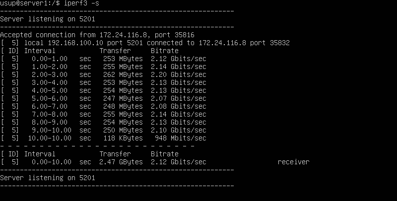
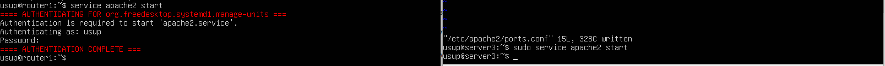
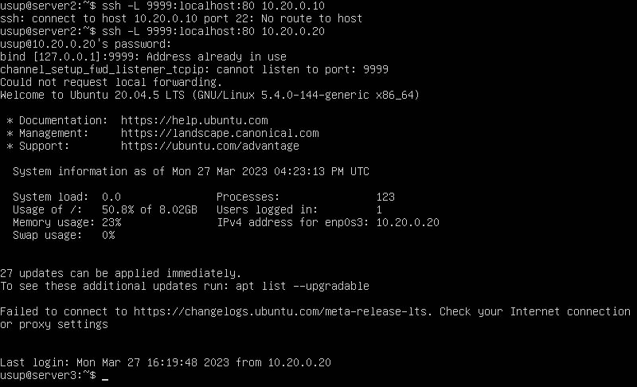
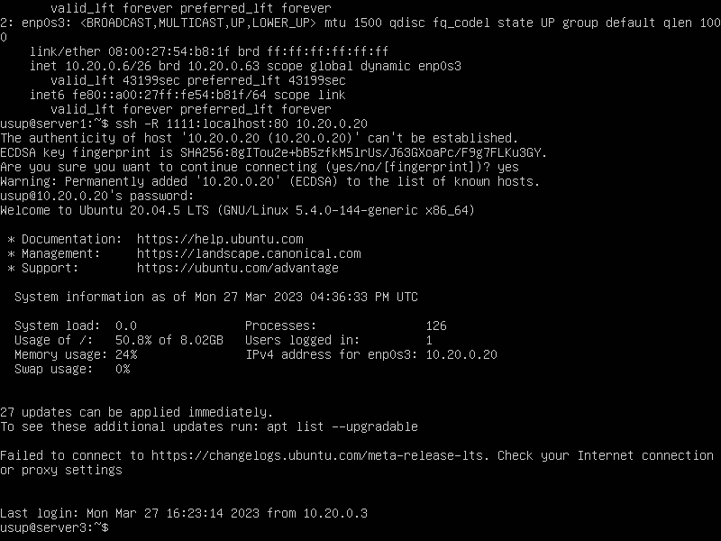
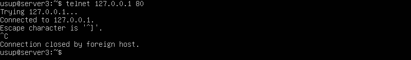

# Сети в Linux

## Part 1. Инструмент ipcalc
### 1.1 Сети и маски
1) адрес сети 192.167.38.54/13  
   
2)  перевод маски 255.255.255.0 в префиксную и двоичную запись
     
    /15 в обычную и двоичную  
     
    11111111.11111111.11111111.11110000 в обычную и префиксную  
     
3)  минимальный и максимальный хост в сети 12.167.38.4 при масках: /8,  
     
   11111111.11111111.00000000.00000000
     
    255.255.254.0   
     
    и /4  
     
   ### 1.2 localhost  
 * Можно обратиться 127.0.0.2, 127.1.0.1  
* Обраититься нельзя  194.34.23.100,  128.0.0.1  
### 1.3  Диапазоны и сегменты сетей
1.  
   * 10.0.0.45 частный
   * 134.43.0.2 публичный
   * 192.168.4.2 частный
   * 172.20.250.4 частный
   * 172.0.2.1 публичный
   * 192.172.0.1 публичный
   * 172.68.0.2 публичный
   * 172.16.255.255 частный
   * 10.10.10.10 частный
   * 192.169.168.1 публичный
2.  какие из перечисленных IP адресов шлюза возможны у сети 10.10.0.0/18:
    * 10.10.0.2
    * 10.10.10.10
    * 10.10.1.255  
## Part 2. Статическая маршрутизация между двумя машинами
 * С помощью команды ip посмотрим существующие сетевые интерфейсы  
   ws1  
      
   ws2  
     
* Сетевой интерфейс для ws1 и ws2 - enp0s3.
*  Зададим следующие адреса и маски: ws1 - 192.168.100.10, маска /16, ws2 - 172.24.116.8, маска /12 для:  
   ws1
     
   ws2  
     
  * Выполним команду netplan apply для перезапуска сервиса сети для:  
   ws1  
     
   ws2  
    
   ### 2.1. Добавление статического маршрута вручную
   * Добавим статический маршрут от одной машины до другой и обратно и пропингуем  
  ws1  
     
    ws2  
   
### 2.2. Добавление статического маршрута с сохранением 
 * Добавим статический маршрут через netplan  
    ws1  
       
    ws2  
     
* Изменения сохраним командой netplan apply
* Пропингуем соединение между машинами  
   ws1  
       
    ws2  
     
## Part 3. Утилита iperf3
### 3.1 Скорость соединения  
*  8 Mbps в MB/s = 1 MB/s
*  100 MB/s в Kbps = 819 200 Kbps
*   1 Gbps в Mbps = 1024  Mbps
### 3.2. Утилита iperf3
* Для измерения скорости соединения между ws1 и ws2 запустим сервер на ws1 и подключится к нему через ws2  
ws1  
  
ws2  
  
## Part 4. Сетевой экран
### 4.1. Утилита iptables
* Фаил /etc/firewall.sh для:  
  ws1  
  
ws2  

* Запуск обоих файлов   
  ws1  
  
ws2  

* Разница межде стратегиями заключаеться в том, что первая запрешает передачу ICMP пакетов, в вторая нет.
### 4.2. Утилита nmap
* sw2 пингуеться   

* sw1 не пингуеться, но находиться через nmap  

## Part 5. Статическая маршрутизация сети
### 5.1. Настройка адресов машин
- Задаем стачисеские адреса машинам  
  ws11  
  
  ws21  
  
 ws22  
  
r1  
  
r2  
  
- Обновляем настройки и проверяем IP  
  ws11  
  
  ws21  
  
 ws22  
  
r1  
  
r2  
  
- Пингуем:
   ws22 с ws21  
  
    r1 с ws11  

### 5.2 Включение переадресации IP-адресов.  
Для включения переадресации IP, выполним команду на роутерах  
  
Для включения переадресации IP, выполним команду на роутерах   на постоянной основе  
  
### 5.3. Установка маршрута по-умолчанию
- Настроим маршрут по-умолчанию (шлюз) для рабочих станций и покажем, что добавился маршрут в таблицу маршрутизации  

- Пропингуем с ws11 роутер r2 и покажем на r2, что пинг доходи  
  
### 5.4. Добавление статических маршрутов
- Добавим в роутеры r1 и r2 статические маршруты и показажем таблицы с маршрутами на обоих роутерах  
  
- Запустим команды на ws11:
ip r list 10.10.0.0/[маска сети] и ip r list 0.0.0.0/0  
  
- Для адреса 10.10.0.0/[маска сети] был выбран маршрут, отличный от 0.0.0.0/0, 
потому что есть маршрут который описывает ее лучше.

### 5.5. Построение списка маршрутизаторов
- Запустим на r1 команду дампа **tcpdump -tnv -i eth0** и при помощи утилиты traceroute пострим список маршрутизаторов на пути от ws11 до ws21  
  
  
 
 Для определения промежуточных маршрутизаторов traceroute отправляет целевому узлу серию ICMP-пакетов (по умолчанию 3 пакета), с каждым шагом увеличивая значение поля TTL («время жизни») на 1. Это поле обычно указывает максимальное количество маршрутизаторов, которое может быть пройдено пакетом. Первая серия пакетов отправляется с TTL, равным 1, и поэтому первый же маршрутизатор возвращает обратно ICMP-сообщение «time exceeded in transit», указывающее на невозможность доставки данных. Traceroute фиксирует адрес маршрутизатора, а также время между отправкой пакета и получением ответа (эти сведения выводятся на монитор компьютера). Затем traceroute повторяет отправку серии пакетов, но уже с TTL, равным 2, что заставляет первый маршрутизатор уменьшить TTL пакетов на единицу и направить их ко второму маршрутизатору. Второй маршрутизатор, получив пакеты с TTL=1, так же возвращает «time exceeded in transit».

Процесс повторяется до тех пор, пока пакет не достигнет целевого узла. При получении ответа от этого узла процесс трассировки считается завершённым.

На оконечном хосте IP-датаграмма с TTL = 1 не отбрасывается и не вызывает ICMP-сообщения типа срок истёк, а должна быть отдана приложению. Достижение пункта назначения определяется следующим образом: отсылаемые traceroute датаграммы содержат UDP-пакет с заведомо неиспользуемым номером порта на адресуемом хосте. Номер порта будет равен 33434 + (максимальное количество транзитных участков до узла) — 1. В пункте назначения UDP-модуль, получая подобные датаграммы, возвращает ICMP-сообщения об ошибке «порт недоступен». Таким образом, чтобы узнать о завершении работы, программе traceroute достаточно обнаружить, что поступило ICMP-сообщение об ошибке этого типа.

### 5.6. Использование протокола ICMP при маршрутизации 
- Запустим на r1 перехват сетевого трафика, проходящего через eth0 с помощью команды **tcpdump -n -i eth0 icmp**
  
и пропингуем с ws11 несуществующий IP  
  
## Part 6. Динамическая настройка IP с помощью DHCP
- Начнем с настройки r1. В файле /etc/dhcp/dhcpd.conf пропишем необходимые конфигурации
  
 в файле resolv.conf пропишем **nameserver 8.8.8.8.**  
Перезагрузим службу DHCP командой **systemctl restart isc-dhcp-server**
Вернем дефортные насйтроки netplan машины ws21, перезагрузим ее  и через **ip a** покажем, что она получила адрес. Также пропингуем ws22 с ws21.

- Укажем MAC адрес у ws11  
  
- Для r1 настроим аналогично r2, но сделаем выдачу адресов с жесткой привязкой к MAC-адресу (ws11).
   
  
 - Запросить с ws21 обновление ip адреса  
 
## Part 7. NAT
- В файле /etc/apache2/ports.conf на ws22 и r1 изменить строку Listen 80 на Listen 0.0.0.0:80  
  r1
  
ws22   
     
- Запустить веб-сервер Apache командой service apache2 start на ws22 и r1
     
- Добавить в фаервол удаление правил в таблице filter, удаление правил в таблице "NAT", отбрасывать все маршрутизируемые пакеты  

Запустим файл       
  
Проверим соединение между ws22 и r1
  
- Разрешим маршрутизацию всех пакетов протокола ICMP
  
пропингуем  
  
-  включим SNAT, а именно маскирование всех локальных ip из локальной сети, находящейся за r2 и  включим DNAT на 8080 порт машины r2 и добавим к веб-серверу Apache, запущенному на ws22, доступ извне сети
  
- Проверить соединение по TCP для SNAT и DNAT  
  
  
## Part 8. Дополнительно. Знакомство с SSH Tunnels
Запустим на r2 фаервол с правилами из Части 7
  

Запустим веб-сервер Apache на ws22 только на localhost

Получить доступ к веб-серверу на ws22 с ws21 через  Local TCP forwarding  
  

Воспользуемся Remote TCP forwarding c ws11 до ws22, чтобы получить доступ к веб-серверу на ws22 с ws11  
  

Для проверки, сработало ли подключение в обоих предыдущих пунктах
  
  

  

